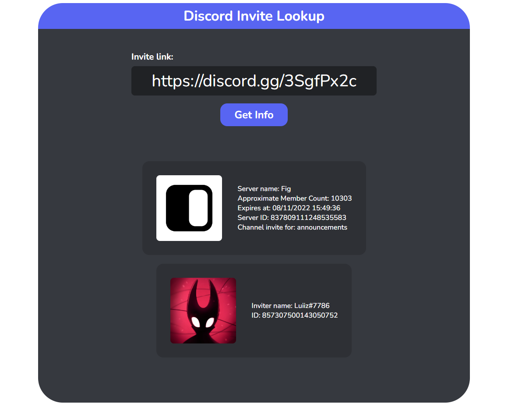

<div id="top"></div>

<!-- PROJECT LOGO -->
<br />
<div align="center">
  <a href="https://github.com/luizfranzon/discordInviteLookup">
    
  </a>

<h3 align="center">Discord Invite Lookup</h3>

  <p align="center">
    An Discord Invite Analyzer to get some info about your invite.

</div>

<!-- ABOUT THE PROJECT -->
## About the project:



### Built With

* [Node.js](https://nodejs.org/)
* [EJS](https://www.npmjs.com/package/ejs)
* [Express](https://www.npmjs.com/package/express)
* [discord-inv](https://www.npmjs.com/package/discord-inv)

<!-- GETTING STARTED -->
## Getting Started

**1- Clone this repository:**
```bash
git clone https://github.com/luizfranzon/discordInviteLookup.git
```
**2- Install dependencies:**
```bash
npm install
```
Or
```bash
yarn
```
**3- Run the server:**
```bash
node SERVER.js
```

<!-- USAGE EXAMPLES -->
## Usage

Get a discord link and paste it in the input field.

<!-- ROADMAP -->
## Roadmap

- [ ] Add responsive layout
- [ ] Improve the UI
- [ ] General Improvements


<p align="right">(<a href="#top">back to top</a>)</p>
